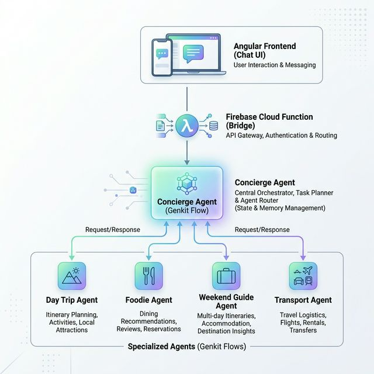
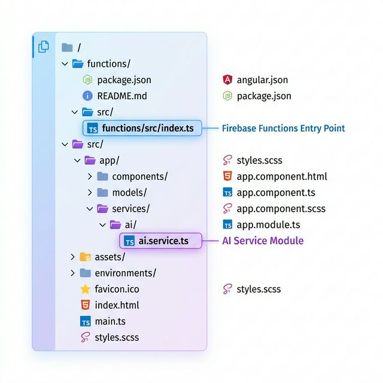

# Agent Concierge - AI Assistant Codelab

Welcome to the **Agent Concierge** codelab! In this workshop, you will build a sophisticated AI-powered travel concierge using **Angular**, **Firebase Genkit**, and **Google Gemini**.

## Overview

In this workshop, you will build a **Concierge AI Assistant** — a multi-agent chatbot that helps users plan day trips, find restaurants, discover weekend activities, and navigate routes. The assistant is powered by **Google Gemini** via **Genkit AI**, deployed on **Firebase Cloud Functions**, and presented through a modern **Angular 21** frontend.

### What you'll build

By the end of this workshop you will have a fully working chat application that:

- Accepts natural language queries from the user
- Routes requests to specialised sub-agents (Day Trip, Foodie, Weekend Guide, Transport)
- Streams responses back to the Angular frontend
- Is deployable to Firebase Hosting + Cloud Functions

### Architecture overview



| Layer | Responsibility |
|---|---|
| **Frontend** | Angular 21 Chat UI with Signal-based state management. |
| **Orchestrator** | Firebase Cloud Function + Genkit Flow (Concierge Agent). |
| **Specialists** | Domain-specific agents (Day Trip, Foodie, etc.) with Search tools. |

### What you'll learn

- How to structure a multi-agent system with **Genkit**
- How to define Genkit **tools** and **flows**
- How to integrate a Firebase Callable Function with an Angular service
- How to use Angular **signals** for reactive state management

---

## Prerequisites

- A **Google Cloud Project** with billing enabled.
- **Google Cloud Shell** access.
- **Firebase CLI** installed (available by default in Cloud Shell).
- A **Gemini API Key** from [Google AI Studio](https://aistudio.google.com/).

---

## Step 1: Firebase Project Setup

### 1.1 Create a Firebase Project

Before anything else, you need a Firebase project to host your functions and frontend. Selecting a project here automatically creates a corresponding **Google Cloud Project** in the Google Cloud Console.

1. **Open Firebase Console** — Navigate to [Firebase Console](https://console.firebase.google.com/)
2. **Create New Project**
   - Click **"Create a new Firebase project"**
   - Enter a project name (e.g., **"agent-concierge"** or your preferred name)
   - Google Analytics is optional — you can skip it for this workshop
   - Click **"Create project"** and wait for it to be provisioned

### 1.2 Enable Billing

Firebase Cloud Functions and Secret Manager require billing to be enabled on your Google Cloud project. You must do this before proceeding, otherwise later steps (deploying functions and storing secrets) will fail.

1. In the [Firebase Console](https://console.firebase.google.com/), select your newly created project.
2. In the bottom-left corner, click on your current plan (e.g., **"Spark"**) → **"Upgrade"**.
3. Select the **Blaze (pay-as-you-go)** plan.
4. Choose your billing account (or **"Google Cloud Platform Trial Billing Account"** if available).
5. Set a budget alert (e.g., **$2 USD**) to avoid unexpected charges.
6. Click **"Link Cloud Billing Account"** to confirm.

> **Note:** The Blaze plan is pay-as-you-go, but Firebase offers a generous free tier. For a workshop project of this scale, you are very unlikely to incur any charges.

### 1.3 Identify your Google Cloud Project

Your Firebase project is identical to a Google Cloud project. You will perform the rest of the development steps within this project's workspace in the **Google Cloud Console**.

1. Visit the [Google Cloud Console](https://console.cloud.google.com/).
2. Click on the project dropdown at the top.
3. Select the **"All"** tab if you don't see your newly created Firebase project under "Recent".
4. Once you've selected your project, you're ready to proceed to the next step.

---

## Step 2: Clone the Repository

To begin, you need to open your development environment in the Google Cloud Console.

1. **Activate Cloud Shell**: At the top right of the Google Cloud Console, click the **Activate Cloud Shell** icon (`>_`). This opens a terminal at the bottom of your browser window.
2. **Open Editor**: In the Cloud Shell toolbar, click the **"Open Editor"** button. This transitions the interface to show the code editor alongside the terminal.
3. **Select your project**: Ensure you have the correct Firebase/Google Cloud project selected as described in Step 1.3.

Now, run the following command in the **Cloud Shell Terminal** to clone the project. This downloads the starter code — a pre-built Angular app with placeholder `// TODO` markers where you will add the AI logic throughout this workshop.

```bash
git clone https://github.com/waynegakuo/agents-concierge-starter-code.git
cd agents-concierge-starter-code
```

> **Note:** Once you've cloned the project, you can toggle back and forth between the shell and the editor as needed. The "Open Editor" button will change to **"Open Terminal"** (or return back to the editor) depending on your current view.
>
> If you prefer to use a terminal within the editor itself, select **"Terminal"** → **"New Terminal"** from the top menu. This will open a terminal pane at the bottom of the editor. If you choose this option, remember to `cd agents-concierge-starter-code` to ensure you are in the correct directory for the steps that follow.

> **Important:** Because you're using the Google Cloud online editor, sometimes hidden files cannot be seen (e.g., `.firebaserc`). You can see them by selecting **"View"** → **"Toggle Hidden Files"** from the top menu in the editor.

---

## Step 3: Environment Setup

### 3.1 Install Dependencies

Install the Angular CLI globally and the project dependencies. The `--force` flag is used to resolve any peer-dependency version conflicts that may arise between packages.

```bash
# Install Angular CLI globally
npm install -g @angular/cli

# Install dependencies (using --force to handle potential version conflicts)
npm install --force
```

The `functions` directory has its own `package.json` and its own set of dependencies (Genkit, Firebase Functions, etc.) that are separate from the root project. You need to install those too:

```bash
# Navigate into the functions directory and install its dependencies
cd functions
npm install --force

# Go back to the project root
cd ..
```

### 3.2 Configure `.firebaserc`

The `.firebaserc` file tells the Firebase CLI which Firebase project to target when you run commands like `firebase deploy`. Replace `YOUR_PROJECT_ID` with the actual project ID from your [Firebase Console](https://console.firebase.google.com/).

> **Note:** If you cannot see the `.firebaserc` file, make sure you have "Toggle Hidden Files" enabled in the "View" menu.

**File:** `.firebaserc`
```json
{
  "projects": {
    "default": "YOUR_PROJECT_ID"
  }
}
```

### 3.3 Initialize Firebase

Now, log in to Firebase using the `--no-localhost` flag, which is required in Cloud Shell because there is no browser available to complete the standard OAuth redirect. This command will print a URL — open it in your local browser, authenticate, and paste the resulting code back into the terminal.

```bash
# Note: Initializing now as it requires knowing the PROJECT_ID from .firebaserc 
firebase login --no-localhost
```

### 3.4 Configure Firebase Environment

The Angular app reads your Firebase project configuration from the environment file. This is how AngularFire knows which Firebase project to connect to when making calls to Cloud Functions.

#### Register your web app

Before you can copy the config values, you need a web app registered in your Firebase project:

1. Go to [Firebase Console](https://console.firebase.google.com/) and select your project.
2. On the sidebar, click the gear icon (⚙️) below "Project Overview" → **"Settings"**.
3. Select 'General' and scroll down to the **"Your apps"** section.
4. If you don't have a web app yet, click **"Add app"** → Web icon (`</>`).
5. Give your app a name (e.g., **"Agent Concierge Web App"**).
6. Check the **"Firebase Hosting"** box.
7. Click **"Register app"**.
8. For the following steps, you can click on **"Next"** and even the last step where it says **"Continue to Console"**.

Once registered, go to the **"SDK setup and configuration"** section in the project settings and copy the SDK configuration snippet. Open `src/environments/environment.development.ts` and replace the placeholder values with the real values.

**File:** `src/environments/environment.development.ts`
```typescript
export const environment = {
  production: false,
  firebaseConfig: {
    apiKey: "YOUR_API_KEY",
    authDomain: "YOUR_PROJECT_ID.firebaseapp.com",
    projectId: "YOUR_PROJECT_ID",
    storageBucket: "YOUR_PROJECT_ID.appspot.com",
    messagingSenderId: "YOUR_MESSAGING_SENDER_ID",
    appId: "YOUR_APP_ID",
    measurementId: "YOUR_MEASUREMENT_ID"
  },
};
```

### 3.5 Enable Required APIs

Before setting up your API key, you need to enable the Secret Manager API in your Google Cloud project. This API is what allows Firebase Functions to securely store and retrieve your Gemini API key at runtime.

1. **Go to Google Cloud Console:**
   - Visit the [Google Cloud Console](https://console.cloud.google.com/)
   - Make sure your Firebase project is selected in the project dropdown
   - Click on "Dashboard" to see the project's overview page
2. **Enable the Secret Manager API:**
   - Click the **Navigation Menu** (hamburger icon ☰) at the top-left of the Google Cloud Console.
   - Select **"APIs & Services"** > **"Library"**.
   - Search for **"Secret Manager API"**.
   - Click on it and press **"Enable"**.

> **Note:** Other APIs (Cloud Functions, etc.) are automatically enabled when you deploy Firebase Functions.

### 3.6 Set up Gemini API Key

Rather than hard-coding your API key in source code (which would be a security risk), you store it as a **Firebase Secret**. Firebase Functions will automatically inject it as an environment variable at runtime, keeping it out of your codebase entirely.

1. **Go back to the terminal** (either the Cloud Shell or the Editor terminal) to continue.
2. Ensure you are in the project's root directory: `agents-concierge-starter-code`.
3. Run the following command to set the secret:

```bash
firebase functions:secrets:set GEMINI_API_KEY
```

> **Note:** When prompted to enter the secret, the input is **masked** for security. This means you will not see any characters (not even asterisks) as you paste your key. Simply paste it once and press **Enter**.

*(You can get your API key from [Google AI Studio](https://aistudio.google.com/api-keys))*

---

## Step 4: Explore the Project Structure

Take a few minutes to familiarise yourself with the key files in both the frontend and backend directories.



### Key Files Overview

| Path | Description |
|---|---|
| `src/app/services/ai/ai.service.ts` | **⭐ You will build this.** Connects the Angular app to Genkit. |
| `functions/src/index.ts` | **⭐ You will build this.** Contains Genkit agents and Cloud Functions. |
| `src/app/components/chat/` | Logic, template, and styles for the main chat interface. |
| `src/app/models/chat.model.ts` | Data interfaces shared across the frontend. |

### Models (`chat.model.ts`)

This file defines the TypeScript interfaces that are shared across the frontend. Understanding these will help you follow the data flow as you build the service and read the chat component code.

| Interface | Fields | Purpose |
|---|---|---|
| `Message` | `text`, `formattedText?`, `sender`, `timestamp` | Represents a single chat bubble displayed in the UI. `sender` is either `'user'` or `'ai'`. `formattedText` holds the sanitised HTML version of the AI's markdown response. |
| `ConversationMessage` | `role`, `content` | A lightweight history entry sent to the backend with each request. `role` is either `'user'` or `'model'` (matching Gemini's expected format). |
| `WelcomeCapability` | `icon`, `title`, `description` | Describes one capability tile shown on the welcome screen before the user sends their first message. |

### How the chat component works

`chat.ts` already handles:

1. Displaying the conversation
2. Capturing user input via a reactive form
3. Maintaining `conversationHistory` for multi-turn context
4. Calling `aiService.sendMessage(query, history)` — which you will implement

---

## Step 5: Implementing the Backend (Firebase Functions & Genkit)

Navigate to `functions/src/index.ts`. You will find several `// TODO` markers. Copy and paste the following snippets into their respective locations.

### TODO: Define your Gemini API Key secret

This tells Firebase Functions that your function requires the `GEMINI_API_KEY` secret. At runtime, Firebase will securely inject the secret's value as an environment variable, making it available via `process.env.GEMINI_API_KEY`.

```typescript
const GEMINI_API_KEY = defineSecret('GEMINI_API_KEY');
```

### TODO: Enable Firebase telemetry logging

This enables Genkit's built-in integration with Firebase's observability tools (Cloud Logging and Cloud Trace), so you can monitor your AI flows, inspect inputs/outputs, and debug issues directly in the Google Cloud Console.

```typescript
enableFirebaseTelemetry();
```

### TODO: Configure Genkit

This initializes the Genkit AI framework with the Google AI plugin, which provides access to Gemini models. The `model` field sets `gemini-3.1-flash-lite-preview` as the default model used for all `ai.generate()` calls unless overridden. The `ai` object is your main entry point for defining flows, tools, and generating responses.

```typescript
const ai = genkit({
  plugins: [googleAI({apiKey: process.env.GEMINI_API_KEY})],
  model: googleAI.model('gemini-3.1-flash-lite-preview'),
});
```

### TODO: Configure Genkit Function Config

This configuration object is passed to every Firebase Cloud Function that wraps a Genkit flow. It does three things:
- **`secrets`** — grants the function access to the `GEMINI_API_KEY` secret at runtime.
- **`region`** — deploys the function to `africa-south1` for lower latency if your users are in Africa (change this to the region closest to your users).
- **`cors: true`** — allows the Angular frontend (running on a different origin) to call the function directly from the browser.

```typescript
const GENKIT_FUNCTION_CONFIG = {
  secrets: [GEMINI_API_KEY],
  region: 'africa-south1',
  cors: true, 
};
```

### TODO: Schema for conversation messages

Zod schemas define the shape of data flowing in and out of your Genkit flows and tools. Here you define a `conversationMessageSchema` that represents a single chat message with a `role` (either `'user'` or `'model'`) and a `content` string. The `ConversationMessage` TypeScript type is then inferred directly from the schema, keeping your types and runtime validation in sync.

```typescript
const conversationMessageSchema = z.object({
  role: z.enum(['user', 'model']),
  content: z.string(),
});

type ConversationMessage = z.infer<typeof conversationMessageSchema>;
```

### TODO: Convert history to Genkit format

Genkit's `ai.generate()` expects messages in a specific format where each message's content is an array of parts (e.g., `[{ text: '...' }]`). This helper function converts your flat `ConversationMessage[]` history array (coming from the frontend) into that Genkit-compatible structure, so you can pass the full conversation context to the model.

```typescript
function toGenkitMessages(history: ConversationMessage[]) {
  return history.map((msg) => ({
    role: msg.role as 'user' | 'model',
    content: [{text: msg.content}],
  }));
}
```

### TODO: Define Agent Tool Logics

Each sub-agent is defined as a **Genkit tool** using `ai.defineTool()`. A tool is a callable unit that the parent (Concierge) agent can invoke when it decides the query matches that tool's responsibility. Each tool:

- Has a **`name`** and **`description`** that the Concierge Agent's LLM reads to decide which tool to call.
- Accepts an **`input`** string (the user's query) and an optional **`history`** array (the conversation so far).
- Calls `ai.generate()` with a **system prompt** specific to that agent's domain and enables **`googleSearchRetrieval`** so the model can ground its answers with live web search results.
- Returns the model's text response as a plain string.

```typescript
export const _dayTripAgentToolLogic = ai.defineTool(
  {
    name: 'dayTripAgentTool',
    description: 'Assists with planning day trips',
    inputSchema: z.object({
      input: z.string(),
      history: z.array(conversationMessageSchema).optional(),
    }),
    outputSchema: z.string(),
  },
  async ({input, history}) => {
    const response = await ai.generate({
      system: DAY_TRIP_AGENT_PROMPT,
      messages: [
        ...toGenkitMessages(history ?? []),
        {role: 'user', content: [{text: input}]},
      ],
      config: { googleSearchRetrieval: {} },
    });
    return response.text;
  }
);

export const _foodieAgentToolLogic = ai.defineTool(
  {
    name: 'foodieAgentTool',
    description: "Assist with finding the best restaurants",
    inputSchema: z.object({
      input: z.string(),
      history: z.array(conversationMessageSchema).optional(),
    }),
    outputSchema: z.string(),
  },
  async ({input, history}) => {
    const response = await ai.generate({
      system: FOODIE_AGENT_PROMPT,
      messages: [
        ...toGenkitMessages(history ?? []),
        {role: 'user', content: [{text: input}]},
      ],
      config: { googleSearchRetrieval: {} },
    });
    return response.text;
  }
);

export const _weekendGuideAgentToolLogic = ai.defineTool(
  {
    name: 'weekendGuideAgentTool',
    description: 'Assists in finding interesting events and activities',
    inputSchema: z.object({
      input: z.string(),
      history: z.array(conversationMessageSchema).optional(),
    }),
    outputSchema: z.string(),
  },
  async ({input, history}) => {
    const response = await ai.generate({
      system: WEEKEND_GUIDE_AGENT_PROMPT,
      messages: [
        ...toGenkitMessages(history ?? []),
        {role: 'user', content: [{text: input}]},
      ],
      config: { googleSearchRetrieval: {} },
    });
    return response.text;
  }
);

export const _findAndNavigateAgentToolLogic = ai.defineTool(
  {
    name: 'findAndNavigateAgentTool',
    description: 'Assists with finding the best routes and transportation',
    inputSchema: z.object({
      input: z.string(),
      history: z.array(conversationMessageSchema).optional(),
    }),
    outputSchema: z.string(),
  },
  async ({input, history}) => {
    const response = await ai.generate({
      system: TRANSPORT_AGENT_PROMPT,
      messages: [
        ...toGenkitMessages(history ?? []),
        {role: 'user', content: [{text: input}]},
      ],
      config: { googleSearchRetrieval: {} },
    });
    return response.text;
  }
);
```

### TODO: Define Concierge Agent Logic & Flow

This is the **orchestrator** — the top-level agent that receives every user message and decides which sub-agent tool to delegate to. It is defined as a **Genkit flow** using `ai.defineFlow()`, which makes it callable and traceable.

- The flow passes the user's message and conversation history to the model along with the `CONCIERGE_AGENT_PROMPT` (which instructs it to act as a router).
- The `tools` array registers all four sub-agent tools. The LLM will automatically call the appropriate tool based on the user's intent.
- `onCallGenkit()` wraps the flow as a **Firebase HTTPS Callable Function**, applying the shared config (secrets, region, CORS) and exposing it as the `conciergeAgentFlow` endpoint that the Angular frontend will call.

```typescript
export const _conciergeAgentLogic = ai.defineFlow(
  {
    name: 'conciergeAgentFlow',
    inputSchema: z.object({
      input: z.string(),
      history: z.array(conversationMessageSchema).optional(),
    }),
    outputSchema: z.string(),
  },
  async ({input, history}) => {
    const response = await ai.generate({
      system: CONCIERGE_AGENT_PROMPT,
      messages: [
        ...toGenkitMessages(history ?? []),
        {role: 'user', content: [{text: input}]},
      ],
      tools: [
        _dayTripAgentToolLogic,
        _foodieAgentToolLogic,
        _weekendGuideAgentToolLogic,
        _findAndNavigateAgentToolLogic,
      ],
    });
    return response.text || response.output;
  }
);

export const conciergeAgentFlow = onCallGenkit(GENKIT_FUNCTION_CONFIG, _conciergeAgentLogic);
```

---

## Step 6: Implementing the Frontend (Angular AI Service)

Navigate to `src/app/services/ai/ai.service.ts`.

### TODO: Define the AI service and its methods

This Angular service is the bridge between the chat UI and your Firebase Cloud Function. Here is what each part does:

- **`inject(Functions)`** — uses Angular's `inject()` function to get the AngularFire `Functions` instance, which is pre-configured with your Firebase project settings from `app.config.ts`.
- **`httpsCallable()`** — creates a typed callable reference to the `conciergeAgentFlow` Cloud Function by name. This is the same name you gave the flow in `index.ts`.
- **`from()`** — wraps the `Promise` returned by the callable into an RxJS `Observable`, so the chat component can subscribe to it reactively.
- The method accepts the current user `input` and the full `history` array, forwarding both to the backend so the model has conversation context.

Replace the contents of that `ai.service.ts` file with the code snippet below:

```typescript
import { inject, Injectable } from '@angular/core';
import { Functions, httpsCallable } from '@angular/fire/functions';
import { from, Observable } from 'rxjs';
import { ConversationMessage } from '../../models/chat.model';

@Injectable({
  providedIn: 'root',
})
export class AiService {
  private functions = inject(Functions);

  sendMessage(input: string, history: ConversationMessage[]): Observable<any> {
    const conciergeAgentFlow = httpsCallable<any, any>(
      this.functions,
      'conciergeAgentFlow'
    );
    return from(conciergeAgentFlow({ input, history }));
  }
}
```

---

## Step 7: Updating the UI

Navigate to `src/app/app.html`.

### TODO: Replace all contents with the Chat component reference

The root `app.html` template is the entry point of your Angular application. Replace all the existing placeholder content with a single reference to the `app-chat` component.

> **Important:** As with any Angular component, you must ensure that `Chat` component is imported into the `imports` array of the component **where** it is being used (in this case, likely `App` component in `app.ts`).
>
> Also, since we replaced all contents, you can go ahead and delete the `RouterOutlet` import in the `imports` array, and its corresponding `import` statement at the top of the file, as it is no longer being used in the `App` component.

```html
<app-chat />
```

---

## Step 8: Deployment

Finally, deploy your application to Firebase.

- **`ng build`** compiles the Angular application into optimised static assets (HTML, CSS, JS bundles) and outputs them to the `dist/` folder, ready to be served by Firebase Hosting.
- **`firebase deploy`** uploads both the compiled frontend to Firebase Hosting and the Cloud Functions code to Firebase Functions in a single command.

```bash
# Build the Angular application
ng build

# Deploy to Firebase
firebase deploy
```

> **Troubleshooting:**
> If you encounter an error like `HTTP Error: 403, Cloud Billing API has not been used in project [name_of_project] before or it is disabled`, click on the link provided in the terminal on the site to visit to enable the Cloud Billing API. Wait a few seconds for the API to be enabled, return to the terminal, and run the `firebase deploy` command again.

Once deployed, your concierge assistant is live! 🎉

You can now test the application by visiting the **Hosting URL** provided in your terminal output (e.g., `https://your-project-id.web.app`). Open this link in a new browser tab and try asking your assistant natural language questions like:
* "Can you plan a day trip to Paris?"
* "What are some good restaurants in Tokyo?"
* "Find me a route from London to Glasgow."

---

## Step 9: Monitor Genkit Flows and Tools

Genkit integrates natively with Firebase to automatically log telemetry data (traces, metrics, and tool executions) for your deployed flows. This monitoring dashboard is invaluable for debugging and understanding how your AI agents behave in production.

By using the Genkit dashboard, you can:
- **Inspect Inputs and Outputs:** See exactly what prompt was sent to the Gemini model and what answer it returned.
- **Track Tool Selection:** See which specific sub-agent (e.g., Foodie Agent vs. Day Trip Agent) the orchestrator chose for a given user query.
- **Debug Failures:** If a flow fails or an answer seems incorrect, the traces will highlight where the error occurred.

### Set up Genkit Monitoring

Since we enabled telemetry in our code (`enableFirebaseTelemetry()`), we just need to activate the dashboard in the Firebase Console:

1. Go back to your project in the [Firebase Console](https://console.firebase.google.com/).
2. On the left sidebar menu, find the **"Product categories"** section.
3. Expand **"AI services"** and click on **"Genkit"**.
4. Click **"Get Started"**, then under the second option ("Deploy and Monitor Genkit features"), click **"Monitor my app"**.
5. Select **"Firebase Functions"** as your deployment target and click **"Next"**.
6. Since we already added the Firebase plugin in our source code earlier, simply click **"Next"** again.
7. Click on **"Check for metrics"**.

> **Note:** Metrics and traces are not instantaneous. If the dashboard shows no data right away, don't worry! Try sending a few more test queries from your live web app to generate more traffic, then wait about 5 minutes and check the metrics page again.
